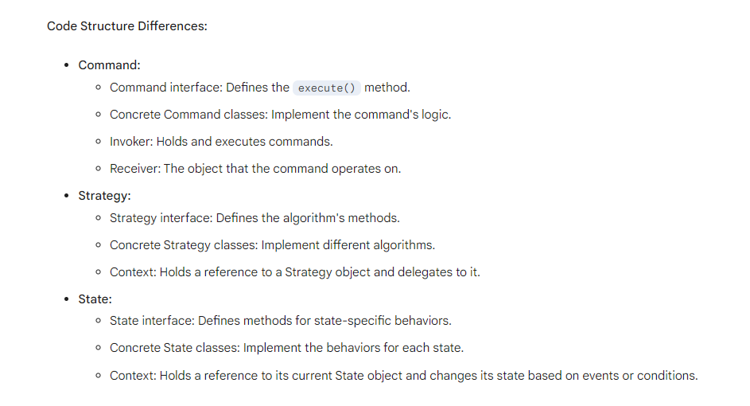

ㅤ
ㅤ

# UAS Framework Layer Architecture

\
__Made for:__
> _Framework Layer Architecture_
>
> [ LEC ] -  Final Semester

\
__Composed by:__
> 2501977941 - Kevin Gunawan
>
> ChatGPT (Best Boi)

ㅤ

## Structural Patterns (7)

- Adapter
- Bridge
- Composite
- Decorator
- Flyweight
- Facade
- Proxy

> Ada Ridge's Compost Decorate her Proxy Facade quite Flyweightly.  

### Adapter
Bayangin ada dua interfaces yang berbeda.
```java
interface JSON;
interface XML;
```

Ada dua class juga yang implements dari interfaces tersebut.
```java
class JSONData;
class XMLData;
```

Ketika ada suatu method yang accept parameter dari suatu interface, dia jadi gak bisa proses data lain KECUALI ia ber-datatype JSON.
```java
void unparseData (JSON _object) {}
```

Solusinya pakai adapter adalah:
```java
class XML_AdapterTo_JSON implements JSON {
//                                  ↑ ini harus berlawanan
      XML data;
//    ↑ dengan yang ini!
}
```

Jadi, kita bisa cemplungin adapter `XML_AdapterTo_JSON` ke method `unparseData`:
```java
XML data = new XML("<xml></xml>")
JSON convertedData = new XML_AdapterTo_JSON(data)

unparseData(convertedData)
```

ㅤ

### Bridge
Mengurangi jumlah interfaces yang lu harus implement, dengan menggabungkannya ke satu large interface.

\
Anggap ada abstract class dengan attribut-nya:
```java
public abstract class Picture {
    private DisplayMethod displayMethod;

    public Picture (DisplayMethod _dp) {
        this.displayMethod = _dp;
    }

    public abstract void displayPicture();
}
```

```java
public interface DisplayMethod {
    void display();
}
```

\
Secara logika, supaya lu bisa display sebuah picture dari storage, lu harus:
1. Retrieve data-nya dari storage
2. Decode data yang di-compress pas ia berada di storage
3. Koordinasi dengan OS agar diijinkan nampilin gambarnya di layar

\
Interface si `DisplayMethod` itu ngumpetin keribetan harus implements banyak interface. Sehingga jika perlu dibongkar, maka sebenernya abstract class `Picture` itu harus di-declare sebagai:

```java
public abstract class Picture implements DataRetriever, Decompressor, OSCommunicator {

    @Override
    public Stream<Binary> retrieveDataFromStorage() {}

    @Override
    public Stream<Binary> decompressData(DataFormat _format) {}

    @Override
    public void requestToShowImage (Stream<Binary> _image) {}

    public Picture () {}

    public abstract void displayPicture();
}
```

ㅤ

### Composite
Imagine lu punya class yang bisa menampung banyak instance dari class lain:
```java
public class WindowsFolder {
    private ArrayList<Object> children = new ArrayList<>();
//          ↑ bisa nampung banyak instance dari class lain

    public addContent (Object _o) {
        children.add(_o);
    }
}
```

Ini sudah bisa dibilang Composite pattern: asal ia bisa menampung dirinya sendiri, atau object lain didalamnya.

ㅤ

### Decorator
Ini itu kaya lu wrap suatu object dengan class lain, yang mana menambahkan functionality ke object originalnya.

Even though si object original ga bisa utilize the added functionality,  object wrapper-nya very much bisa.

Imagine lu punya wiper mobil. Wiper itu ga berguna by itself.

Sekarang tempelin wiper-nya ke mobil. Wiper itu sekarang adalah bagian dari mobil.

By itself, dia gabisa utilize water sprayer-nya si mobil; tapi setelah mobil dipasangkan wipernya, kaca bisa di-wipe, dan water sprayer akhirnya berguna sekarang.

```java
interface DecoratableComponent {
    void operation();
}

interface Decorator extends DecoratableComponent {
    DecoratableComponent getDecoratedComponent();
}

class ConcreteComponent implements DecoratableComponent {
    @Override
    public void operation() {
        System.out.println("Concrete component operation");
    }
}

class ConcreteDecorator implements Decorator {
    private DecoratableComponent decoratedComponent;

    public ConcreteDecorator(DecoratableComponent decoratedComponent) {
        this.decoratedComponent = decoratedComponent;
    }

    @Override
    public void operation() {
        // Add additional behavior before or after
        System.out.println("Decorator added behavior before");
        decoratedComponent.operation();
        System.out.println("Decorator added behavior after");
    }

    @Override
    public DecoratableComponent getDecoratedComponent() {
        return decoratedComponent;
    }
}
```

ㅤ

### Facade
Menutupi betapa berantakannya logic yang perlu dilakukan, untuk melakukan suatu hal.

\
Imagine lu adalah **GitHub**. Lu mau delete account ***anibani@gmail.com***.

Logikanya, lu harus melakukan demikian secara bertahap:
1. Delete semua comments/issues/commit histories/etc pada repository miliknya.
2. Delete semua repositories yang dia punya.
3. Delete semua gists yang dia punya.
4. Baru hapus account-nya.

\
Untuk memudahkan prosesnya, buatlah facade yang nutupin logika-logika tsb kedalam satu function: `deleteAccount(emailAddress)`

Sehingga, pas developer intern ngerjain something yang perlu menghapus account, dia tinggal pakai method `deleteAccount()`; dan gak perlu panggil method-method `removeComments()`, `removeIssues()`, `removeCommitHistories()`, etc.

ㅤ

### Flyweight
Flyweight pattern sama aja seperti caching, dimana ia mengurangi beban pada sistem dengan menggunakan ulang result yang udah pernah diproses, selama result itu masih up-to-date.

\
Imagine sebuah factory yang merupakan bagian dari Factory Method pattern:
```java
public interface Factory <T> {
    public T make (Object... _params);
}

public class ColorFactory () {
    public Color make (Object... _params) {
        return new Color (_params[0], _params[1], _params[2]);
    }
}
```

Method diatas 'mahal' sebab ia selalu membuat object instance dari class `Color` setiap kali method `make()`-nya dipanggil.

\
Solusinya menggunakan `Flyweight` pattern ialah dengan meng-introduce caching:
```java
interface MenuItem {
    void display(int tableNumber);
}

class ConcreteMenuItem implements MenuItem {
    private final String name;
    private final String description;
    private final double price;

    public ConcreteMenuItem(String name, String description, double price) {
        this.name = name;
        this.description = description;
        this.price = price;
    }

    @Override
    public void display(int tableNumber) {
        System.out.println("Order for table " + tableNumber + ":");
        System.out.println("- " + name + " - " + description + " - $" + price);
    }
}

class MenuFactory {
    private final Map<String, MenuItem> menuItems = new HashMap<>();

    public MenuItem getMenuItem(String name) {
        if (!menuItems.containsKey(name)) {
            menuItems.put(name, new ConcreteMenuItem(name, description, price));
        }
        return menuItems.get(name);
    }
}

public class Restaurant {
    private final MenuFactory menuFactory = new MenuFactory();

    public void takeOrder(String itemName, int tableNumber) {
        MenuItem menuItem = menuFactory.getMenuItem(itemName);
        menuItem.display(tableNumber);
    }

    public static void main(String[] args) {
        Restaurant restaurant = new Restaurant();
        restaurant.takeOrder("Burger", 12);
        restaurant.takeOrder("Pizza", 4);
        // Both orders share the same Burger and Pizza flyweight instances
    }
}
```

ㅤ

### Proxy
Mengontrol akses ke suatu class.

\
Bisa dilakukan dengan meng-clone suatu class yang sudah jadi, dan tambahkan if clause saat melakukan operasi:

```java
interface UserDatabaseTableAccessor {
    public List<User> getAll();
}

class UserRepository implements UserDatabaseTableAccessor {
//    ↑ Class yang udah jadi

    @Override
    public List<User> getAll() {
        return User::all()
    }

}

class UserRepositoryProxy implements UserDatabaseTableAccessor {

    private UserRepository repoInstance;
//          ↑ instance dari class yang udah jadi

    public UserRepositoryProxy () {
        this.repoInstance = new UserRepository();
    }

    @Override
    public List<User> getAll () {

//      ↓ Proxy pattern harus ada conditionals
        if ( CURRENT_USER.role == User.UserRole.ADMIN ) {
            return repoInstance.getAll();

        } else {
            throw new RuntimeException("Unauthorized");

        }
    }

}
```

ㅤ

•••

ㅤ

## Behavorial Patterns (10)

- CoR
- State
- Strategy
- Command
- Mediator
- Iterator
- Visitor
- Template Method
- Observer
- Momento

> `State` `Command` is the `Responsibility` of the `Observer`, whose `Moment` is `Templated` by the `Visitor` whose `Strategy` is to `Chain` the `Iterator` to the `Mediator`.

ㅤ

### Chain of Responsibility
Intelligently passes on the unprocessable request to the next handler.

```java
public interface Handler {
    public void handle();
    public boolean canHandle();
    public void setNextHandler();
}

public class ConcreteHandler1 implements Handler {
    private Handler nextHandler;
    
    public ConcreteHandler1 () {}
    
    @Override
    public void handle () {
        if ( this.canHandle() ) {
            ...
            
        } else {
            nextHandler.handle();
            
        }
    }
    
    @Override
    public boolean canHandle () {
        ...
    }
    
    @Override
    public void setNextHandler (Handler _h) {
        this.nextHandler = _h;
    }
}
```

ㅤ

### Command, Strategy, and State
Yang membedakan Command pattern dengan Strategy adalah:

> **COMMAND DITARUH DI CLASS YANG MENGURUS CLASS LAIN:**

 - DIASOSIASI DENGAN ABSTRACT CLASS

 - Imagine lu pesen Boba Sundae di Mixue;

 - Lu gatau apa" tentang nyiapin Boba Sundae;

 - Tapi ketika lu pesen itu ke staffnya, mereka knows what to do.

 - Sehingga, mereka-lah yang operasikan mesin eskrim-nya dan prepare semua utk lu.

- In this essence, you just ordered them to prepare Boba Sundae.

ㅤ

> **STRATEGY DITARUH DI DALAM CLASS WHOSE METHOD DIPANGGIL UNTUK MENGEKSEKUSI SOMETHING**

- Imagine lu mau pergi ke kampus;

- Lu bisa naik Mobil/Motor/Public Transport.

- Lu boleh pilih yang manapun, dan hasilnya akan sama: lu sampai di kampus.

- So in essence, lu punya attribut strategy, dan ketika lu mau ke kampus, lu execute that strategy.

ㅤ

**STATE hampir sama dengan STRATEGY pattern, dimana ia disimpan di class yang bersangkutan, dan based on what state the class has, behavior yang dilakukannya bisa berbeda.**

Perbedaannya adalah
> PADA STATE PATTERN, CLASS ITU SENDIRI BISA MENGGANTI STATE YANG DIMILIKINYA; DIMANA STRATEGY HARUS DIATUR DARI LUAR



ㅤ

### Iterator
Alternative for foreach loop.

ㅤ

### Mediator
Imagine pattern ini sebagai kondisi kabel di belakang monitor: **berantakan, tapi memungkinkan hasilnya untuk terjadi.**

> Adalah pattern yang men-define tempat dimana object-object berhubungan satu sama lain.

Anggap React button yang pakai useState hook untuk increment counter.

Counter tsb harus di simpan di suatu tempat, dan pas button di-click: retrieve data yang disimpan itu, tambahin satu, dan masukkan yang baru ke storage dan display itu.

Mediator kurleb gitu.

ㅤ

### Momento
Menyimpan snapshot atas keadaan/kondisi suatu object pada suatu waktu.

Biasanya deep-copy sebuah object, dan simpan itu kedalam List yang semakin index-nya tinggi, semakin recent itu.

ㅤ

### Observer
Memungkinkan semua 'subscribers' untuk diberi tahu ketika object yang mereka 'observe' telah berganti datanya.

ㅤ

### Template Method
Merupakan method yang ada didalam sebuah abstract class: dimana ia memanggil abstract method lain, yang implementasinya diserahkan ke class implementor.

ㅤ

### Visitor
This is the Visitor pattern!

ㅤ

## In-Class Quiz
ABC Resorts, a leading hospitality brand, has provided opulent experiences globally for years.

While their online booking system was key, the recent acquisition of ResortPro presents integration challenges due to differing interfaces and data formats.

> ABC aims for seamless assimilation without disrupting the user experience.

    ↑  Bisa facade maupun
       adapter yang connect both
       application together

ㅤ

To stay competitive, ABC Resorts seeks to optimize its pricing strategy.

> The current fixed model lacks adaptability to market changes, leading to plans for a dynamic pricing system that adjusts based on factors like seasonal demand and competitor pricing.

    ↑  Strategy / State pattern
       soalnya bisa tergantung
       bagaimana keadaan
       pengunjung
       maupun kebijakan
       pihak ABC Resorts

ㅤ

In enhancing guest services, ABC Resorts acknowledges evolving traveler expectations.

> They aim to modernize their robust but inflexible guest services system to incorporate new technologies and communication channels, accommodating future advancements.

    ↑  Bridge pattern, sebab ia
       memungkinkan separasi
       dari abstraction
       dengan implementation

ㅤ

As ABC Resorts expands accommodations, managing diverse room types and packages becomes complex.

> They plan to revamp the accommodation management system for unified handling of individual accommodations and package structures, simplifying operations.

    ↑  Jika ada keyword
       'structures', pasti
       Composite pattern

ㅤ

ABC Resorts' diverse departments lack a centralized communication mechanism, causing coordination challenges.

> They aim to implement a cohesive system promoting better communication and collaboration across departments.

    ↑  Bisa pakai Mediator
       maupun Composite pattern

ㅤ

In customizing room features, ABC Resorts faces challenges with the current inflexible system.

> They seek a solution allowing dynamic customization without relying on an excessive number of subclasses, avoiding complexities associated with the current inheritance model.

    ↑  Menghindari inheritance bisa
       diakalin pakai Decorator
       pattern, yang mana ia
       menambahkan functionality
       tanpa perlu inherit

ㅤ

For operational excellence, ABC Resorts aims to
> implement a structured solution for managing diverse guest requests and commands for better organization, execution and monitoring.

    ↑ Command pattern

ㅤ

ABC Resorts manages extensive guest data and seeks a solution for
> extracting meaningful insights without modifying existing data models, allowing dynamic addition of new analysis techniques.

    ↑  Visitor pattern

ㅤ

<b> Your task is to find all possible design patterns for the above case and draw the class diagram for each design pattern! </b>

