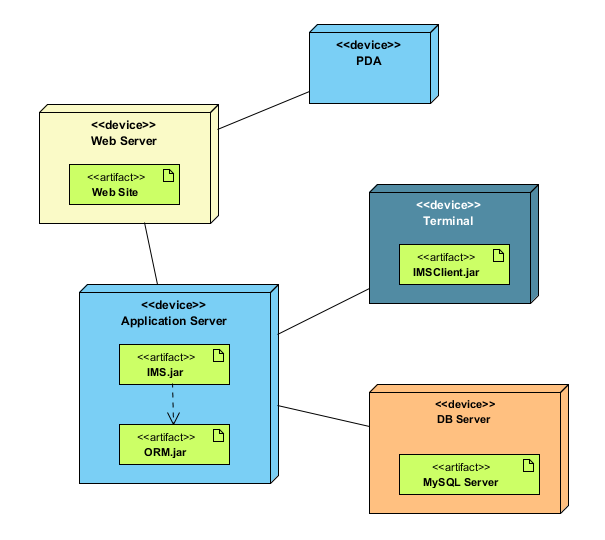
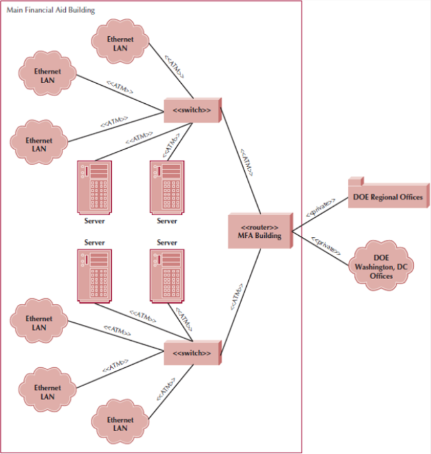

ㅤ
ㅤ
# UAS Object Oriented Analysis & Design

\
__Made for:__
> _Object Oriented Analysis & Design_
>
> [ LEC ] -  Final Semester

\
__Composed by:__
> 2501977941 - Kevin Gunawan
>
> ChatGPT (Best Boi)
>
> Bard (Good Boi)

ㅤ

## Essay

### Coupling, Cohesion, and Connascence

> **Coupling**:\
This is like how much the blocks depend on each other.

- **High (Close) coupling**:

  Blocks are glued together, so changing one means rebuilding the whole thing. This is bad because it's hard to fix.

  ```java
    class OrderProcessor {
        private PayPalGateway paymentGateway = new PayPalGateway();
    //          this is a concrete implementation  ↑
    //                 thus, it is Highly Coupled

        ...
    }
  ```

- **Low coupling**:

  Blocks simply sit on top of each other. Changing one doesn't break the others, making it easier to build and fix.

  ```java
    interface PaymentGateway {
        void processPayment(double amount);
    }

    class PayPalGateway implements PaymentGateway {
        ...
    }

    class OrderProcessor {
        private PaymentGateway paymentGateway;

        public OrderProcessor(PaymentGateway paymentGateway) {
            this.paymentGateway = paymentGateway;
    //           ↑ dependency injection is one of the best
    //             indicator that your code is loosely coupled.
        }
    }
  ```

> **Cohesion**:\
This is how well the blocks go together within a section.

- **High cohesion**:

    All the blocks in a section are of the same color or shape. They make sense together!

    ```java
    class OrderProcessor {
            private EmailService emailService;
            private InvoiceGenerator invoiceGenerator;
            private InventoryManager inventoryManager;
    //              ↑  Ia mendelegasikan tugasnya ke class yang
    //                 khusus dibuat untuk mengerjakan tugas itu,
    //                 sehingga ia dikatakan team player: atau juga highly cohesive.

            public void processOrder(Order order) {
                emailService.sendOrderConfirmationEmail(order);
                invoiceGenerator.generateInvoice(order);
                inventoryManager.updateInventory(order);
            }
        }
    ```

- **Low cohesion**:

  We have a red block next to a yellow block and a square block next to a circle. It's all jumbled up!

  ```java
    class OrderProcessor {
        public void processOrder(Order order) {
            sendOrderConfirmationEmail(order);
            generateInvoice(order);
            updateInventory(order);
    //      ↑  ketika suatu class melakukan semuanya sendiri,
    //         ia di-compare dengan lone wolf, yang mana tidak
    //         ditemani oleh class lain, sehingga merupakan
    //         kebalikan dari kohesi.
        }
    }
  ```


> **Connascence**:\
This is like knowing which blocks will need to change together if we change one.

- **High connascence**:

  If we change the red block, we might also need to change the yellow block because they're part of the same picture.

  ```java
    class Address {
        private String street;
        private String city;
        private String state;
        private String zipCode;
    }

    class Order {
        private String customerName;
        private Address shippingAddress;
        private Address billingAddress;
    }
  ```

- **Low connascence**:

  Changing the red block doesn't affect the circle block because they're not connected.

  ```java
    class Order {
        private String customerName;
        private String shippingAddress;
        private String billingAddress;
    }
  ```

ㅤ

### System and User Interface
UI is concerned with the `visual aesthetics and layout`; whereas UX encompasses the `entire interaction` a user has with a product.

Usability is a key consideration in UI design, ensuring that the interface is easy to navigate and understand.

Consistent UI design ensures that users can predict how elements behave throughout an application.

Implementing responsive design to ensure a seamless experience across various devices is key consideration for mobile UI design.

In user interfaces, the following are types of navigation controls:
- Keyboard shortcuts and gestures
- Language-based commands and instructions
- Menus and dropdown lists
- Direct manipulation through touch or mouse interaction
- Voice recognition systems for hands-free control

ㅤ

### Designing Tests

> Test ada untuk memastikan apabila code yang ditulis behave as expected.

ㅤ

"behave as expected" means bahwa test memastikan agar code terhindar dari error-error berikut:
- **Compile Error**: code tidak bisa di-compile (syntax err)
- **Runtime Error**: code meledak immidiately ketika dijalankan
- **Logic Error**: code berjalan seperti normal, tapi hasil yang dikeluarkan diverge dari ekspektasi.

ㅤ

Testing bisa dilakukan kapan aja; tapi idealnya dilakukan continuously throughout dev process.

Effort untuk testing biasanya lebih besar kebanding aktivitas lainnya.

ㅤ

Sebelum lu bisa uji suatu code, lu harus:
1. Plan the test

   - Setiap test harus punya objective yang perlu dibuktikan (biasanya fokus ke suatu use cases)

   - Tulis semua constraint yang perlu dipenuhi agar lulus test.

2. Pilih tipenya
   
   - **UNIT TESTS**:

     Test yang fokus ke **SATU** class/method/function

     Dia terbagi menjadi 2 jenis:

     > **A. Black Box Testing**
     >
     > Test yang lu lakukan **`KETIKA LU GATAU INNER WORKING`** object yang lu uji.
     >
     > Berhubungan dengan:
     > - CRC Cards
     > - Behavior State Machines
     > - Method Contracts
     > 
     > `"User bisa ngapain? Itu yang gw tes"`

        ㅤ

     > **B. White Box Testing**
     >
     > Test yang lu lakukan **`KETIKA LU TAU INNER WORKING`** object yang lu uji.
     > 
     > Misal lu mau ngetes apakah logic validasi berhasil/gak.
     > 
     > `"Gw tau apa yang code ini should behave like, jadi gw coba-coba nyari keadaan dimana code ini melenceng dari ekspektasi"`
    
        ㅤ

   - **INTEGRATION TESTS**:
  
      Test yang menguji **`APAKAH DUA ATAU LEBIH class/method/function yang harus menyelesaikan tugas bersama BEHAVE AS EXPECTED`**
      
      Ada 4 macam integration tests:
      
      1. User interface testing
      2. Use case testing
      3. Interaction testing
      4. System interface testing
    
        ㅤ

   - **SYSTEM TESTS**:
      
      Test yang menguji **`SELURUH class/method/function BEKERJA SAMA TANPA ERROR`** .
      
      Dia itu mirip sama integration tests, namun lebih besar scope-nya.
    
        ㅤ
   - **ACCEPTANCE TESTS**:
      
      Test yang menguji **`APAKAH SYSTEM YANG DIBUAT SUDAH MEMENUHI SELURUH KEBUTUHAN CLIENT (SUPPORT SEMUA USE CASE)`**
      
      Ada 2 macam:
      
      - **Alpha Testing:**
        
        Data yang digunakan itu buatan
        
      - **Beta Testing:**
        
        Data yang digunakan itu REAL, dengan emphasis ke edge cases yang di-expect akan muncul
        
ㅤ

### Developing Documentation

Dokumentasi adalah penjelasan dari sistem (bagaimana kerjanya, bagaimana menggunakannya, apa yang harus dilakukan jika mau develop the system further).

ㅤ

Dokumentasi ada, karena:

1. anggaplah lu bikin lego.
2. lu gabisa asal tempelin lego block, untuk menjadi sesuatu yang bagus
3. paling setidaknya, lu perlu gambaran apa yang mau dibuat agar block yang benar bisa ditaro ditempat yang benar.

> Atau, lihat juga dari sudut pandang yang pakai dokumentasi:
> - **New people joining the team**: It's like a welcome pack for new folks, giving them a quick crash course on the system without having to bug everyone else for help.
> - **Coming back to a system after a while**: It's like a refresher course when you've been away from a project for a bit and need a reminder of how things work.
> - **Troubleshooting a problem**: It's like having a mechanic's manual for when things go wrong, helping you diagnose issues and find solutions.

ㅤ

Dokumentasi dibagi menjadi 2:

- **System Documentation**: that assists programmers/analyst to build and maintain the system
    
- **User Documentation**: that assists users on how to operate the system; as most of them will not read the manual before using the system.

ㅤ

Here's why it's so important:

1. **Clarity and Knowledge Transfer**:

    - Documents act as a single source of truth, capturing all essential information about a system. No more relying on tribal knowledge or memory lapses.

    - New team members can quickly onboard and understand how the system works, reducing training time and frustration.

    - Stakeholders can stay informed about the system's purpose, functionality, and limitations.

2. **Improved Efficiency and Quality**:

    - Documentation guides development, reduces duplication of effort, and prevents reinventing the wheel.

    - Clear instructions and procedures minimize errors and inconsistencies, leading to better quality systems.

    - Well-documented systems are easier to troubleshoot and debug, saving time and resources.

3. **Enhanced Collaboration and Communication**:

    - Documents establish a common language and understanding among different teams working on the system.

    - Collaboration becomes smoother when everyone refers to the same information and terminology.

    - Documentation facilitates communication with external stakeholders like clients or regulators.

4. **Future-proofing and Maintainability**:

    - As systems evolve, well-maintained documentation helps developers understand existing code and make informed changes.

    - It becomes easier to add new features or adapt to changing requirements without getting lost in spaghetti code.

    - Documentation ensures the system's longevity and value even when the original developers move on.

ㅤ


Types of Documentation:

- **Reference Documents**: tell users on how to perform a SPECIFIC tasks. (Focuses on simple, often singular, little things)

- **Procedure Manuals**: describes how to perorm business tasks; and where each procedure entails multiple tasks.(Focuses on the broader how-to)

- **Tutorials**: teach people on how to use specific components of a system. (Broadest of them all, often using video as the format)

ㅤ

Structure of a Documentation:
1. Develop a set of navigation controls that spans different topics of documentation.
2. Topics generally come from 3 sources:
   - Commands and menus in the user interface
   - How to perform certain tasks, which can be found in:
     - Use scenarios
     - WNDs
     - Real use-cases
   - Definitions of important terms

ㅤ

## Case

### 1.) Analysing Architecture

Architecture basically ngebahas: **`software apa jalan di hardware mana`**.

\
Ada 6 poin yang harus diingat:
1. Jika bandingin beli infrastructure atau sewa, **`mahalan yang mana`**?
2. Apakah **`mahal untuk develop`** system di infra tsb?
3. Apa **`susah`** bikin system di infra tsb?
4. **`Kelebihan`** infra tsb apa kembanding infra yang lain?
5. Infra-nya aman gak? Seberapa **`ketat keamanannya`**?
6. Jika demand-nya bertambah, apa infra tsb **`gampang untuk di-scale up`**?

\
Architecture ada 2 komponennya:

1. **Software Components**
   
   yang membahas tentang
   - dimana lu simpan data, pakai apa?
   - gimana lu retrieve data, pakai aplikasi khusus API ato manual query SQL?
   - logic apa yang ada di dalam apl (business logic)?
   - presentation logic
   
2. **Hardware Components**
   
   yang membahas tentang
   - siapa client dari sistem lu? (user's device -- e.g. komputer, hp, dll)
   - spec dari server (intel i5 12xxx), pelengkap server (mounting rack, kipas, dll) apa?
   - jaringan yang connects antar device apa? (pakai dial-up, high-speed fiber, dll)

\
Macam-macam architecture ada 3:
1. **Server-based architecture**
   
   - **`Client terima jadi`**
   
   - Semua pekerjaan (data storage, data access logic, app logic, presentation logic) terjadi di server.
   
2. **Client-based architecture**
   
   - **`Server hanya menyimpan data`**
   
   - Client melakukan mayoritas pekerjaan (data access logic, app logic, dan presentation logic)
   
   - Network traffic akan mahal pakai infra ini.
   
   - Rentan ada bottleneck.
   
3. **Client-server architecture**
   
   - **`Perkerjaan dibagi-bagi`**
   
   - Ada 3 macam Client-server architecture
     
     - **2-tier**
       
       1 server u/ data storage & data access logic;
       
       `client` u/ app logic & presentation logic.
       
     - **3-tier**
       
       1 server u/ dataa storage & data access logic
       
       1 server u/ application logic
       
       `client` u/ presentation logic
       
     - **n-tier**
       
       n server u/ application logic
       
       n server u/ data storage
       
       n server u/ data access logic
       
       `client` u/ presentation logic
       

\
The following table shows the difference between architectures:
|                        | Server-based | Client-based | Client-Server |
| ---------------------- | ------------ | ------------ | ------------- |
| Cost of Infrastructure | Very High    | Medium       | Low           |
| Cost of Development    | Medium       | Low          | High          |
| Ease of Development    | Low          | High         | Low-Medium    |
| Interface Capabilities | Low          | High         | High          |
| Control & Security     | High         | Low          | Medium        |
| Scalability            | Low          | Medium       | High          |

ㅤ

ㅤ

### 2.) Infrastructure Design in Deployment Diagram & Network Model



**Deployment Diagram** memperlihatkan hubungan antara `software apa yang dijalankan di hardware apa` DAN hubungan antara `hardware dengan hardware`.

Pada gambar diatas, kotak 3d menggambarkan Nodes, dan kotak hijau didalamnya menggambarkan Artifacts.

Elemen di deploy diagram ada 3:

- **Nodes**
  
  Bagian dari hardware (Client device, Router, Server, etc.)
  
- **Artifacts**
  
  Software yang dijalankan didalam node
  
- **Communication paths**
  
  Penghubung antara artifacts

ㅤ



**Network model** menggambarkan **secara garis besar** `koneksi antar geolokasi` (antar gedung, antar lantai).

Network model ada untuk:
- Convey betapa ribetnya system yang sudah ada

- Memperlihatkan hardware apa yang ada di suatu lokasi

- Memperlihatkan hardware apa connect dengan apa

ㅤ

---
**Deployment Diagram**: This is like the blueprint of your castle. It shows all the important parts:

- **Towers**: These are your software components, like the main hall, kitchen, or dragon stables (metaphorically speaking!).
- **Walls & Bridges**: These are your servers and networks, connecting everything together.
- **Drawbridges & Gates**: These are security measures that control who can access different parts of the castle.

ㅤ

**Network Model**: This is like the plumbing and wiring of your castle. It shows:

- **Pipes & Tunnels**: These are data channels, carrying information between towers through the walls and bridges.
- **Pumps & Levers**: These are network devices like routers and switches, directing the flow of information.
- **Filters & Traps**: These are security tools that protect your castle from unwanted visitors (or data packets).

ㅤ

**How they're related**: Just like how the plumbing brings water to different parts of the castle, the network model carries data to different software components in the deployment diagram. The deployment diagram shows what components exist, while the network model shows how they talk to each other.
