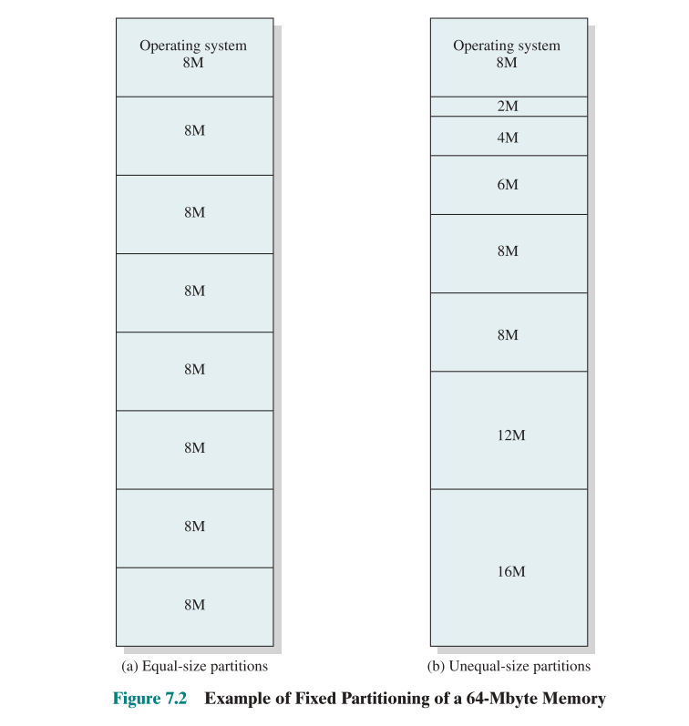
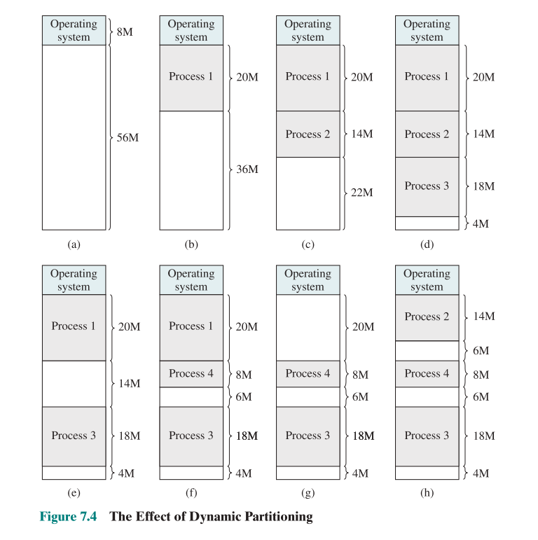
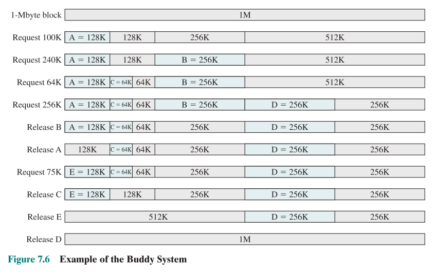
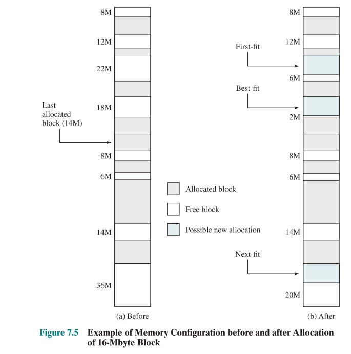
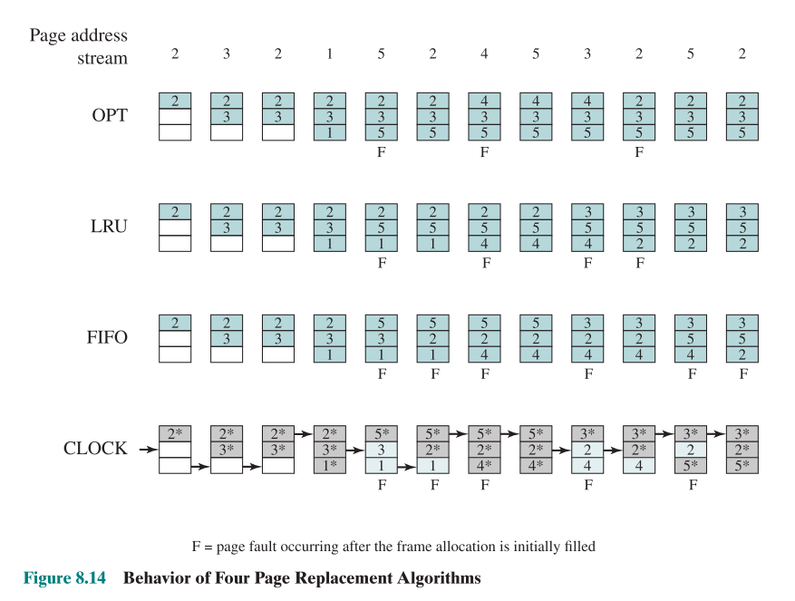
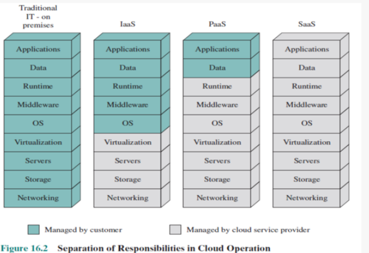

ㅤ
ㅤ
# UAS Operating System

\
__Made for:__
> _Operating System_
>
> [ LEC ] -  Final Semester

\
__Composed by:__
> 2501977941 - Kevin Gunawan
>
> ChatGPT (Best Boi)
>
> Bard (Good Boi)

ㅤ

## Essay & Case

> Bawa penggaris dan kalkulator

### Common File Organization Types
There are 5 ways to organize a file:
1. **Pile**
   
   - Seperti naruh baju kotor di keranjang.
    
   - Hanya kumpulan data yang ditata berdasarkan kapan data tsb dibuat.
   
   - Ukurannya gak uniform, bisa lebih gede/kecil dari yang lain
    
   - Nyari data disini via ***`exhaustive linear search`***.
   
2. **Sequence**
   
   - Paling sering ditemui; **`KAYAK SQL`** (setiap baris terdiri dari jumlah kolom yang sama, dengan urutan kolom yang sama)
   
   - Digunakan untuk menampung records, yang masing-masingnya punya id
   
   - Digunakan di batch application
   
3. **Index**
   
   - Bisa pakai variable-length records.
  
   - Variable-length records-nya itu ada dalam bentuk **`overflow file`**.
   
   - Meskipun di index keliatannya data disimpan bersebelahan, kenyataannya di address mereka bisa berjauhan.
   
4. **Indexed Sequence**

   - Bedanya dengan **`indexed`** adalah, jika di index datanya nampak bersebelahan, maka begitu juga kondisinya di address.

5. **Direct or Hash**
   
   - Menggunakan fixed-length records.
   
   - Langsung mengakses block of a known address, lalu bandingkan hash dengan record yang disimpan untuk mencari datanya.


ㅤ

### 4 Type Disc Scheduling (hitungan)
- **First Come First Serve (FCFS)**
  
  
  
  Sesuai dengan urutan kerjaan dateng.
  
  Seek time:
  - `[50 to 176]ㅤ126ms`
  - `[176 to 34]ㅤ142ms`
  - `[34ㅤto 92]ㅤㅤ58ms`
  - `[92ㅤto 11]ㅤㅤ81ms`
  - `[11 to 114]ㅤ103ms`\
  --------------------------- +\
ㅤㅤㅤㅤㅤㅤㅤㅤ510ms
  
- **Shortest Seek Time First (SSTF)**
  
  
  
  Sesuai mana yang terdekat.
  
  Seek time:
  - `[50 to 41]ㅤㅤ Xms`
  - `[41 to 34]ㅤㅤ Xms`
  - `[34ㅤto 11]ㅤㅤXms`
  - `[11ㅤto 60]ㅤㅤXms`
  - `[60 to 79]ㅤㅤXms`
  - `[79 to 92]ㅤㅤXms`
  - `[92 to 114]ㅤ Xms`
  - `[114 to 176]ㅤXms`\
  --------------------------- +\
ㅤㅤㅤㅤㅤㅤㅤㅤXms
  
- **Scan**
  
  
  
  Mulai ke arah kerjaan yang paling deket.
  
  Lurus terus sampai job di arah itu habis, lalu putar balik.
  
- **C-Scan**
  
  
  
  Mulai ke arah kerjaan yang paling deket.
  
  Lurus terus sampai job di arah itu habis, lalu mentokin ke job paling jauh dari posisi kursor sekarang.
  
  Ikuti arah yang didapat dari awal.
  

ㅤ

### Fixed and Dynamic Partitioning, Buddy System

- **Fixed Partitioning**

  

  ↑ Setiap block sudah dipartisi dari awal, dengan size yang predetermined.
  
  ↑ Process yang kecil masuk ke yang kecil, yang medium ke sedeng, dst. Mana yang paling pas.
  
  ↑ Limits the number of active processes and may use space inefficiently if there is a poor match between available partition sizes and process sizes

- **Dynamic Partioning**

  
  
  ↑ Setiap block dialokasi pas dapet process, dengan size yang sesuai dengan process tsb.
  
  ↑ Ketika process tsb selesai, space yg sudah dipartisi resiko di-bound oleh process yang lain; sehingga tempat yang tersisa BISA AJA gak muat u/ process lain.

- **Buddy System**
  
  
  
  ↑ Pakai 2^n untuk memecah setiap block.


### Placement Algorithm


Ada 3:
1. First fit
   
   Masukin process baru kemanapun yang available; DIMULAI DARI POSISI 0 DARI BEGINNING OF MEMORY
   
2. Best Fit
   
   Hanya masukin process ke tempat yang MOST CLOSELY resembles dengan size yang dia request.
   
3. Next Fit
   
   Masukin process baru kemanapun yang available; DI DEPAN cursor sekarang.

ㅤ

### Virtual Memory Management Basic Algorithms


| Algorithm                      | Conditions                                                                                                                 |
| ------------------------------ | -------------------------------------------------------------------------------------------------------------------------- |
| **OPTIMAL <br/>(OPT)**              | ketika full, ganti apa yang ada dengan page address yang masih jauh bakal kepakainya                                       |
| **LEAST RECENTLY USED <br/>(LRU)**  | ketika full, ganti apa yang ada, dengan page address yang paling last-to-date (pas angka-nya sama, update 'kesegarannya')  |
| **FIRST IN, FIRST OUT <br/>(FIFO)** | ketika full, ganti apa yang ada, dengan page address yang paling last-to-date (pas angka-nya sama, BIARKAN 'kesegarannya') |
| **CLOCK**                      | Buat 2 array: ADDRESSES untuk store **`page address`**, WORTHINESS u/ **`second chances`**. <br/><br/>Setelah input page address baru ke array ADRESSES, selalu turunin satu pointernya.<br/><br/>Ketika page sudah ada di array ADDRESS, buat value di array WORTHINESS jadi 1. <br/><br/> Ketika semua sudah penuh dan perlu masukin address baru, cek array WORTHINESS: jika value di array WORTHINESS pada index-nya pointer adalah 0, ganti value-nya di array ADRESSES dengan yang mau masuk -- jika value-nya 1 di array WORTHINESS, cukup ganti aja ke 0 dan pindahin pointernya maju sekali.<br/><br/>NOTE bahwa pointer hanya bekerja di array ADDRESSES -- jika ada update di array WORTHINESS, **`JANGAN`** update posisi pointer.


ㅤ

### Computer Security (Coding)
**`chmod(file's_path, mode_t)`** is a function that allows user to set a permission associated with a file.

**`chown(file's_path, uid_t, gid_t)`** is a function that allows user to set the group/owner of a file.

\
**Dengan datatype:**

`mode_t`: Arithmetic type used for file attributes.

`uid_t`: Arithmetic type used for user IDs.

`gid_t`: Arithmetic type used for group IDs.

\
**Contoh penggunaan:**
```cpp
#include<iostream>
#include<sys/stat.h>
#include<sys/types.h>

using namespace std;
int main (int argc, char* agrv[]) {
    
    if ( argc != 2 ) {
        cout << "Incorrect usage" << endl;
        return 1;
    }
    
//               ↓  mencoba mengganti permission sebuah file
    int retval = chmod(argv[1], 0644);
    if ( retval < 0 ) {
        cout << "Could not chmod the file" << endl;
        return 1;
    }
    
    return 0;
}

```

ㅤ

### Cloud 
Merupakan satu tipe **`infrastructure`**, yang **`memungkinkan penggunanya untuk meng-harness power dari hardware dan software`** milik provider, secara:
- on demand,
- dari jauh, 
- via interface -- sehingga user tidak bisa communicate directly dengan hardware/software.

\
**`Infrastructure`** membahas tentang **`Software APA jalan di Hardware MANA`**.

\
Ada 3 service model cloud:

> Imagine lu perlu mobil ke kampus. Pilih yang mana?

1. **Software as a Service (SaaS)**
   
   > **Ready-made stock car**: Isi bensin (masukin app-lu), abis itu gaskan.
   
   - Lu akses software yang dijalanin di server provider.
   
   - Gaperlu install local, udah bisa jalan.
   
   - Provider handle apapun yang bakal efek ke kelancaran software yang dijalankan (hardware, dependency, internet connections)
   
2. **Infrastructure as a Service (IaaS)**
   
   > **Bare-metal chasis**: mesin, body, roda, tanki (server, network config, tetebengek) atur sendiri sesuai kebutuhan. Kalo udah kepasang, isi bensin (masukin app-lu), baru gaskan.
   
   - Lu nyewa virtual server, storage, dan networking stuff.
   
   - Security thdp virtual server, aplikasi apa yang dijalanin, dan version OS yang jalan di virtual server ditanggung customer.
   
   - Provider handle agar lu bisa akses virtual server: kapanpun, dimanapun.
   
3. **Platform as a Service (PaaS)**
   
   > **Pre-tuned race car**: modif sendiri (config) apa yang kurang, isi bensin (masukin app-lu), trus gaskan.
   
   - Lu akses dev environment di server provider. 
   
   - Lu bisa taruh/jalanin apapun di environment lu.
   
   - Provider handle agar lu bisa terus ngakses dev environment ini.


#### Separation of Responsibilities



#### Cloud Operating System
Merupakan versi khusus OS yang lebih ***beefy*** untuk menghandle high-performance servers, network, dan fast access storage.

> Embodiment dari IaaS dalam satu software.
